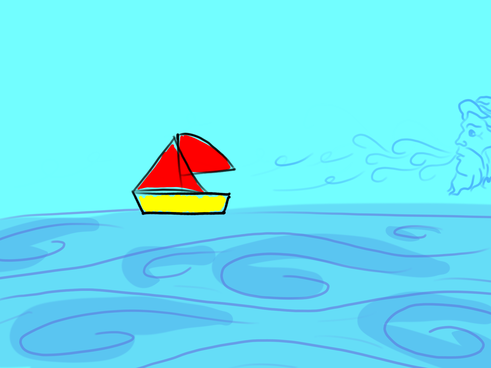

--- 
layout: page
title: Nel Blu
category: poesie
---

Ho una bussola rotta  
buscata da Tia Dalma,  
quale è la mia rotta?  
aspetto con calma  
la prossima fiamma  

fiamma, ha un paio di letture:
- una fiamma in un labirinto mostra lo spostamento d'aria, quindi guida verso 
  strade che non sono a vicolo cieco;
- una fiamma è come un focolare, ti scalda, ti tiene al sicuro e ti
  tranquilizza;
- è molto bella l'immagine della fiamma: quante volte non ci siamo persi a
  guardare il fuoco? rappresenta quella cosa che ci tiene compagnia e che ci fa
  stare bene. ci fa dimenticare del resto;  
- una fiamma brucia e consuma. la vita è una collezione di fiamme, è possibile 
  averne solo un numero finito. ogni volta che ne acquisisci una, ti rimangono 
  meno fiamme da ottenere;
- infine, la fiamma è un memento che moriremo: non importa che cosa si fa nella
  propria vita, prima o poi arriva la morte, che tu la aspetti oppure no.
  si tratta dell'ultima fiamma che tutti raccoglieremo e che tutti abbiamo in
  comune, oltre a quella della vita;  
