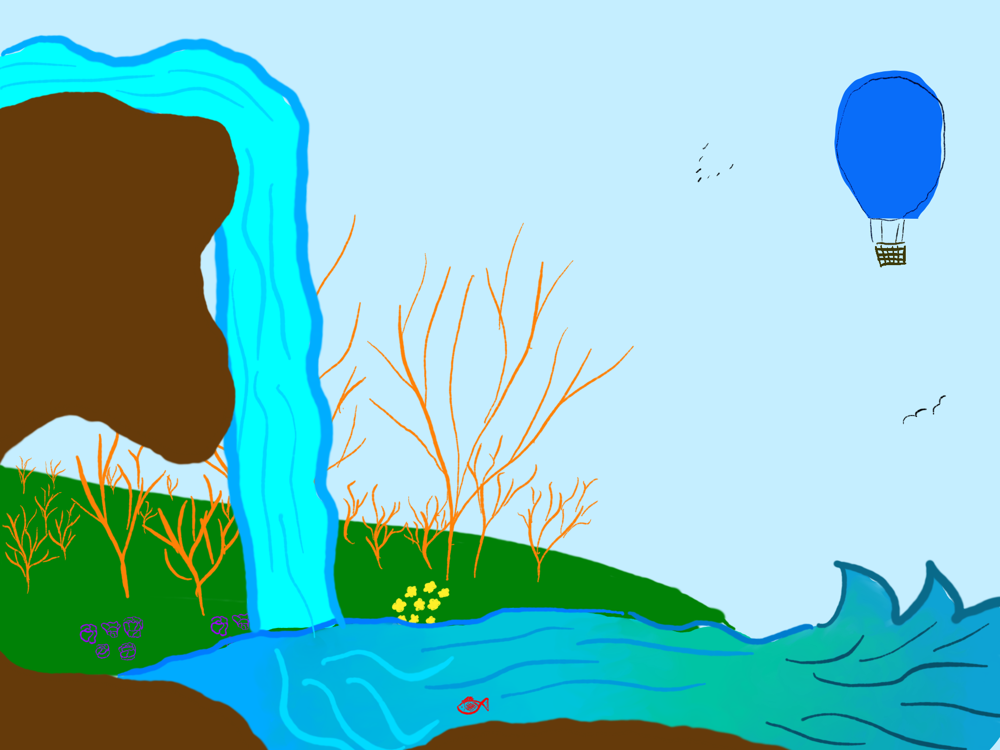

--- 
layout: page
title: Pesce
category: poesia
---

Il persico sole  
vive di briciole,  
in un fiume  
aspettando il lume.  

Il pesce si abbandona alla corrente,  
sembra un palloncino al vento,  
trasportato dal destino attraente,  
alla ricerca dell'argento.  

Nuota forte controcorrente.  
Trasportato dall'immaginazione,  
risale il fiume lentamente  
e giunge all'ultima stazione.  

Fermo sul letto, nella calma del profondo,  
come un guardiano, un custode discreto,  
nel suo mondo tranquillo e giocondo.  
attende la prossima fiamma

